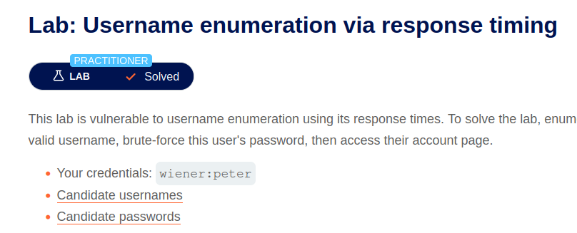
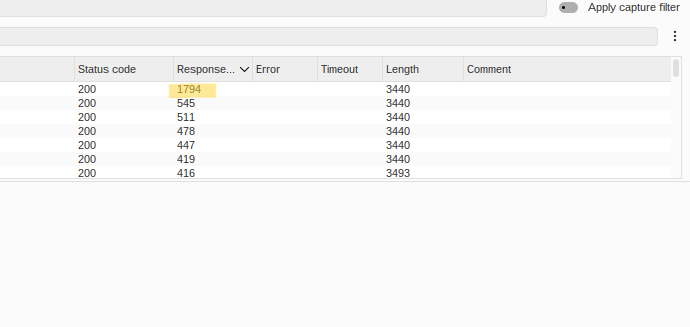
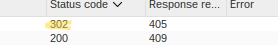

# Lab: Username enumeration via response timing

## Difficulty 
Practitioner

## 취약점
- Username Enumeration
- Response Timing Attack

## 취약점 설명
- 로그인 요청에 대해 존재하는 Username과 존재하지 않는 Username의 응답 시간이 다르게 처리되어 공격자가 Username의 존재 여부를 추측할 수 있는 취약점이다.
- 또한 서버가 `X-Forwarded-For` 헤더를 신뢰하여 IP 기반 Rate Limiting을 우회할 수 있다.

## 취약점 발생 원인
- 존재하는 Username에 대해서만 Password 검증 과정이 수행되어 응답 시간이 증가한다.
- 존재하지 않는 Username은 즉시 로그인 실패를 반환한다.
- `X-Forwarded-For` 헤더를 신뢰하여 요청 IP를 판단한다.

## 발생 가능한 위험
- 유효한 사용자 계정 식별
- Brute Force 공격 성공률 증가
- Credential Stuffing 공격에 악용 가능
- IP 기반 로그인 제한 우회

## 사용한 도구
- Burp Suite Intruder

## 실습 과정
1. 로그인 요청을 Burp에서 캡처
2. Request를 Intruder로 전송
3. `X-Forwarded-For` 헤더를 추가
4. `username`과 `X-Forwarded-For`를 Payload Position으로 지정
5. Attack Type을 'Pitchfork'으로 설정
6. Password는 100자 이상의 긴 문자열로 고정
7. Candidate Username 목록을 Payload로 설정
8. Response Received(Time)를 비교하여 응답 시간이 유의미하게 긴 Username을 찾음 

9. 찾은 Username을 고정한 뒤 Password Wordlist를 이용하여 Brute Force를 수행
10. Status Code가 `302 Found`인 Password를 찾아 로그인 성공 

## Burp 분석

### Request
- POST /login
- Attack Type: Pitchfork
- Header: X-Forwarded-For
- Payload: Username/Password(simple list), X-Forwarded-For(numbers)

### Response
- Response Received(Time) 비교
- Status Code 확인
- Response Length 비교

## 대응 방안
- 존재 여부와 관계없이 동일한 로그인 실패 메시지 및 응답 시간을 반환한다.
- Password 검증 시간을 일정하게 유지한다.
- `X-Forwarded-For`를 신뢰할 수 있는 프록시에서만 사용한다.
- Rate Limiting 및 Account Lockout을 적용한다.
- CAPTCHA 및 MFA를 적용한다.

## 배운 점
- 이번 Lab을 통해 단순히 응답 메시지뿐만 아니라 응답 시간(Response Timing)도 정보가 될 수 있다는 점을 배웠다.
- 또한 `X-Forwarded-For` 헤더를 이용하여 IP 기반 Rate Limiting을 우회할 수 있다는 것을 이해하였다.
- 취약점 진단에서는 Response Message뿐 아니라 Response Time, Status Code, Response Length도 함께 비교하는 습관이 중요하다는 것을 알게 되었다.
