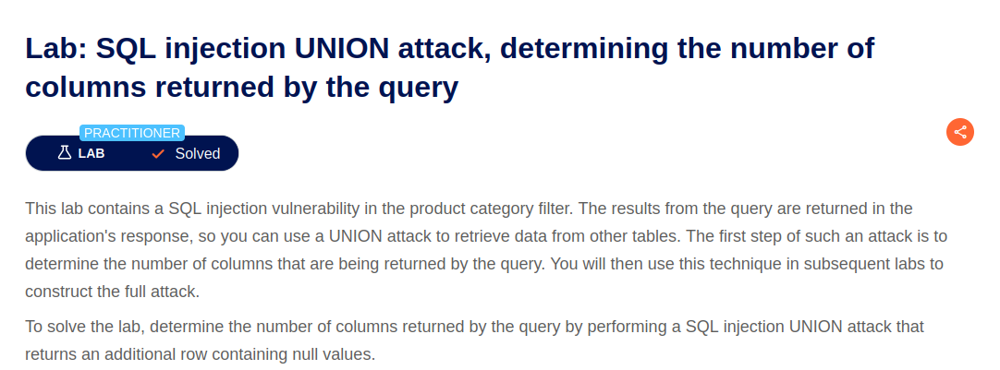
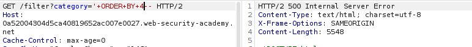
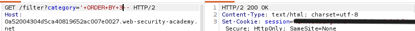
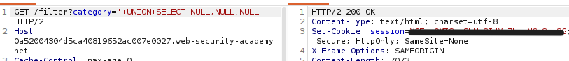
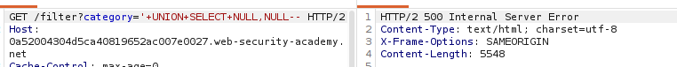

# Lab: SQL injection UNION attack, determining the number of columns returned by the query



## Difficulty

Practitioner

---

## 취약점

- SQL Injection (UNION)

---

## 취약점 설명

1. UNION이란? <br/>
두 개의 SELECT 결과를 합치는 SQL 문법이다.

2. 컬럼 개수를 알아야 하는 이유?<br/>
SQL이 정상실행 되려면 공격자도 컬럼 개수에 맞춰야 해서 이다.

3. 컬럼 개수를 찾는 방법: ORDER BY<br/>
```sql
ORDER BY 1--
```
↓
```sql
ORDER BY 2--
```
↓
```sql
ORDER BY 3--
```
처럼 숫자를 하나 씩 올림


```sql
ORDER BY 4--
```
에서 오류 발생 시 컬럼 개수 3개<br/>
<br/>

4. 이후 검증 방법<br/>
```sql
UNION SELECT NULL,NULL,NULL--
```

5. NULL 사용 이유?<br/>
대부분의 데이터 타입과 호환되므로 UNION SELECT에서 컬럼 개수를 확인할 때 안전하게 사용할 수 있다.
<br/>

## SQL Query

기존 Query

```sql
SELECT name, price
FROM products
WHERE category='Pets';
```

공격

```sql
SELECT name, price
FROM products
WHERE category='Pets'
ORDER BY 3--;
```


---

## 발생 가능한 위험
- UNION 공격을 통해 다른 테이블의 데이터를 조회할 수 있다.
- 사용자 계정, 비밀번호 등 민감한 정보가 노출될 수 있다.
- 데이터베이스의 구조(컬럼 개수, 테이블 정보)를 파악할 수 있다.
- 이후 추가적인 SQL Injection 공격의 기반이 될 수 있다.

---

## 실습 과정
1. Burp Suite에서 GET /filter?category= 요청을 Repeater로 전송

2. ORDER BY 이용하여 컬럼 개수를 확인



<br/>
-> 컬럼 개수: 3<br/>
<br/>

3. 컬럼 개수를 확인한 후 UNION SELECT NULL을 이용하여 컬럼 개수를 검증




```text
'+UNION+SELECT+NULL,NULL,NULL--
```

-> 200 OK 

<br/>
비교)
 NULL 2개 입력 시 



-> 500 Internal Server Error 발생

---

## Payload

```text
'+ORDER+BY+N--
'+UNION+SELECT+NULL,NULL,NULL--
```

---

## 대응 방안
- Prepared Statement(Parameterized Query)를 사용한다.
- 사용자 입력을 SQL Query에 직접 연결하지 않는다.
- 입력값 검증(Input Validation)을 수행한다.
- SQL 오류 메시지를 사용자에게 노출하지 않는다.
- 최소 권한 원칙(Least Privilege)을 적용한다.

---

## 배운 점
이번 Lab을 통해 UNION 공격을 수행하기 위해서는 먼저 기존 SELECT 문의 컬럼 개수를 알아야 한다는 것을 이해하였다.

또한 `ORDER BY`를 이용하여 컬럼 개수를 추론하고, `UNION SELECT NULL`을 이용해 이를 검증하는 방법을 학습하였다.

SQL Injection에서는 무작정 Payload를 사용하는 것이 아니라, 데이터베이스의 구조를 단계적으로 파악한 뒤 공격을 수행하는 과정이 중요하다는 것을 배웠다.
