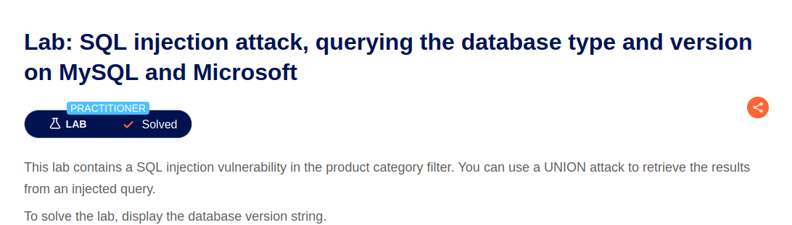
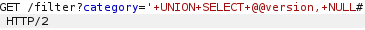
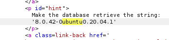
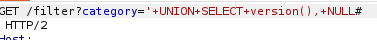
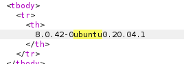

# Lab: SQL injection attack, querying the database type and version on MySQL and Microsoft



## Difficulty

Practitioner

---

## 취약점
- SQL Injection (Database Fingerprinting)

---

## SQL Query

### 기존 Query

```sql
SELECT name, description
FROM products
WHERE category='Gifts';
```

### 공격 Query

```sql
SELECT name, description
FROM products
WHERE category='Gifts'

UNION

SELECT @@version, NULL;
```

### 결과

`@@version`을 이용하여 데이터베이스의 종류와 버전 정보를 조회하였다.

공격자는 이를 통해 대상 시스템의 DBMS 환경을 파악하고, 해당 DBMS에 맞는 SQL Injection Payload를 사용할 수 있다.

---

## 발생 가능한 위험

- 데이터베이스(DBMS)의 종류와 버전 정보가 노출될 수 있다.
- 공격자는 DBMS에 맞는 SQL Injection 기법을 선택하여 공격 성공률을 높일 수 있다.
- 알려진 취약한 DBMS 버전을 대상으로 추가 공격을 수행할 수 있다.
- 데이터베이스 구조 분석 및 정보 수집(Reconnaissance)에 활용될 수 있다.

---

## 사용한 도구

- Burp Suite Repeater

---

## 실습 과정

1. Burp Suite에서 `GET /filter?category=` 요청을 Repeater로 전송
2. `ORDER BY`를 이용하여 컬럼 개수를 확인
3. 문자열(String)이 출력되는 컬럼을 확인
4. `UNION SELECT`를 이용하여 `@@version`을 조회<br/>
 <br/>

```text
'+UNION+SELECT+@@version,NULL#
```

5. 응답(Response)에서 데이터베이스의 종류와 버전 정보를 확인<br/>
 <br/>

---

## 조회한 데이터

- DBMS 종류
- DBMS 버전 정보

---

## 대응 방안

- Prepared Statement(Parameterized Query)를 사용하여 사용자 입력과 SQL Query를 분리한다.
- 사용자 입력을 SQL Query에 직접 연결하지 않는다.
- 데이터베이스의 버전 및 시스템 정보를 사용자에게 노출하지 않는다.
- SQL 오류 메시지를 사용자에게 노출하지 않는다.
- DBMS와 애플리케이션을 최신 보안 패치 상태로 유지한다.
- 데이터베이스 계정에 최소 권한(Least Privilege)을 적용하여 불필요한 시스템 정보 조회를 제한한다.

---

## 배운 점

이번 Lab을 통해 SQL Injection은 단순히 데이터를 조회하는 공격뿐만 아니라, 공격 대상 데이터베이스의 종류와 버전을 파악하는 정보 수집(Reconnaissance) 단계에도 활용될 수 있다는 점을 이해하였다.

또한 DBMS마다 SQL 문법과 함수가 다르므로, 공격자는 먼저 데이터베이스 환경을 식별한 후 그에 맞는 Payload를 사용한다는 점을 학습하였다.

이를 통해 SQL Injection 공격은 데이터 탈취 이전에 대상 시스템을 분석하는 과정부터 시작된다는 것을 알게 되었다.

---

### @@version 과 version()의 차이
Lab solution에서는 @@version을 입력하라고 되어 있었지만 version()을 입력하여도 결과가 출력되길래 궁금하여 찾아보았다.
이 Lab의 경우 MySQL과 Microsoft SQL Server를 사용하기 때문에 둘 다 가능한 @@version을 입력하라고 한 것 같다.
하지만 MySQL의 경우 versoin()을 입력하여도 버전 조회가 가능하기 때문에 결과가 오류 없이 출력된 듯 하다.


version() 사용 예시)
- Request<br/>
 <br/>

- Response<br/>
 <br/>


| DBMS                 | 버전 조회 방법                 |
| -------------------- | ------------------------------ |
| MySQL                | `version()`, `@@version`       |
| PostgreSQL           | `version()`                    |
| Microsoft SQL Server | `@@version`                    |
| Oracle               | `SELECT banner FROM v$version` |

- SELECT version(); -> 함수
- SELECT @@version; -> 시스템 변수 조회
둘 다 버전 정보 조회하는 역할 이지만, 어떤 방식을 지원하는 지는 DBMS마다 다르다. 


---

### 주석처리
이전 Lab에서는 주석 처리로 --을 사용하였었는데, 이번 Lab의 solution에는 #으로 되어 있어 찾아보게 되었다.<br/>
 <br/>

결론은 둘 다 주석 처리이나 아래와 같은 차이가 있었다. 

1. '--'
- ANSI SQL 표준에서 사용하는 주석
- 대부분의 DBMS에서 지원
- 일부 DBMS(MySQL 포함)dms -- 뒤에 공백이 있어야 주석으로 인식

2. '#'
- MySQL 전용 주석
- 공백 없어도 주석으로 처리

3. `/* */` : 여러 줄 주석
