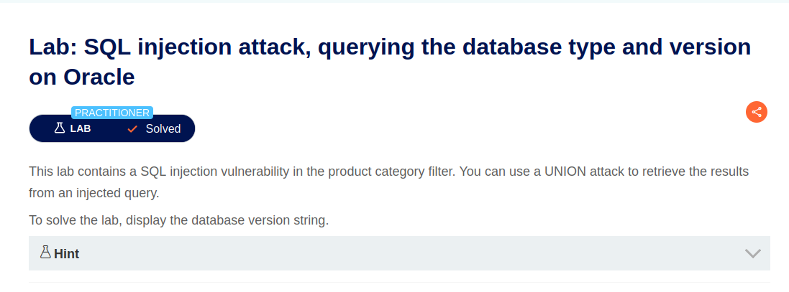
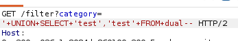
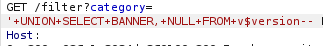
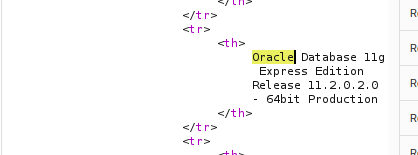

# Lab: SQL injection attack, querying the database type and version on Oracle


## Difficulty

Practitioner

---

## 취약점
- SQL Injection (Database Fingerprinting)

---

## SQL Query

### 기존 Query

```sql
SELECT name, description
FROM products
WHERE category='Gifts';
```

### 공격 Query

```sql
SELECT name, description
FROM products
WHERE category='Gifts'

UNION

SELECT banner, NULL
FROM v$version;
```

### 결과

Oracle의 Dynamic Performance View인 `v$version`에서 `banner` 컬럼을 조회하여 데이터베이스의 종류와 버전 정보를 확인하였다.
- v%: View
- banner: View에 있는 컬럼 명
-> v%version 이라는 시스템 view에서 banner 컬럼 조회

  
공격자는 이를 통해 Oracle DBMS 환경을 파악하고, Oracle에 맞는 SQL Injection Payload를 사용할 수 있다.

---

## 발생 가능한 위험

- Oracle 데이터베이스의 종류 및 버전 정보가 노출될 수 있다.
- 공격자는 Oracle 전용 SQL 문법과 Payload를 사용하여 추가 공격을 수행할 수 있다.
- 알려진 Oracle 취약점을 이용한 공격 가능성이 증가한다.
- 데이터베이스 구조 분석 및 정보 수집(Reconnaissance)에 활용될 수 있다.

---

## 사용한 도구

- Burp Suite Repeater

---

## 실습 과정

1. Burp Suite에서 `GET /filter?category=` 요청을 Repeater로 전송
2. `ORDER BY`를 이용하여 컬럼 개수를 확인
3. 문자열(String)이 출력되는 컬럼을 확인<br/>
<br/>

4. Oracle의 Dynamic Performance View인 `v$version`의 `banner` 컬럼을 조회<br/>
<br/>
```text
'+UNION+SELECT+BANNER,+NULL+FROM+v$version--
```

5. 응답(Response)에서 Oracle Database의 버전 정보를 확인<br/>
<br/>

---

## 조회한 데이터

- Oracle Database 버전 정보
- Oracle Database Edition
- Oracle DBMS 환경 정보

---

## 대응 방안

- Prepared Statement(Parameterized Query)를 사용하여 SQL Injection을 방지한다.
- 사용자 입력을 SQL Query에 직접 연결하지 않는다.
- 데이터베이스의 버전 및 시스템 정보를 사용자에게 노출하지 않는다.
- SQL 오류 메시지를 사용자에게 노출하지 않는다.
- Oracle 데이터베이스를 최신 보안 패치 상태로 유지한다.
- 최소 권한 원칙(Least Privilege)을 적용하여 `v$version`과 같은 시스템 View에 대한 접근 권한을 제한한다.

---

## 배운 점

이번 Lab을 통해 Oracle은 MySQL이나 Microsoft SQL Server와 달리 `version()` 함수나 `@@version` 시스템 변수를 사용하지 않고, `v$version`과 같은 Dynamic Performance View를 통해 데이터베이스 정보를 제공한다는 점을 이해하였다.

또한 DBMS마다 시스템 정보를 조회하는 방식이 다르므로, SQL Injection 공격 시에는 먼저 데이터베이스의 종류를 파악하고 그에 맞는 SQL 문법과 Payload를 사용하는 것이 중요하다는 점을 학습하였다.

이를 통해 같은 SQL Injection이라도 DBMS에 따라 사용하는 함수, 시스템 변수, 시스템 View가 모두 다를 수 있다는 것을 알게 되었다.

### FROM dual
DUAL
: Oracle이 기본적으로 제공하는 특수한 테이블
- 행 1개
- 컬럼 1개(DUMMY)

+-------+
| DUMMY |
+-------+
|   X   |
+-------+

대부분 DBMS에서는 테이블 없어도 값 조회가 가능하지만 Oracle의 경우 SELECT 문은 반드시 FROM 절이 있어야 한다. 
따라서 문자열이나 함수의 결과처럼 실제 테이블과 관계없는 값을 조회할 때는 Oracle이 제공하는 `DUAL` 테이블을 사용한다.

예시)
```sql
SELECT 'Hello'
FROM dual;
```
처럼 dual을 붙여서 조회한다. 

- SELECT 'test' FROM dual -> 조회할 테이블이 없으므로 DUAL O
= SELECT banner FROM v$version -> 실제 View 조회하므로 DUAL X
